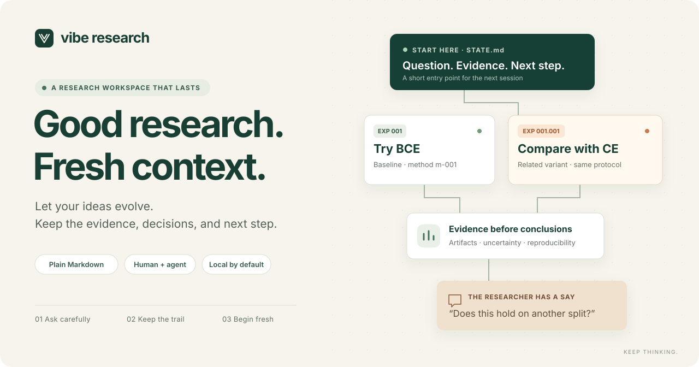
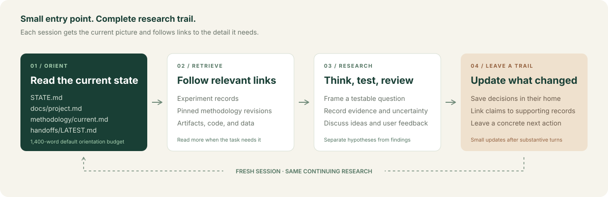

<p align="center">
  
</p>

<p align="center">
  <strong>A small, durable memory for research that keeps changing.</strong><br />
  Markdown for the scientist. Clear instructions for the agent. A fresh session whenever you need one.
</p>

<p align="center">
  <a href="#start-in-two-minutes">Get started</a> ·
  <a href="docs/walkthrough.md">See a research session</a> ·
  <a href="docs/design.md">Read the design</a> ·
  <a href=".agents/skills/vibe-research/SKILL.md">Inspect the skill</a>
</p>

## TL;DR

Vibe Research gives a research project an `AGENTS.md`, a reusable Codex skill, and an ignored `agent-research/` folder. The agent keeps your current question, methodology, experiments, ideas, evidence, and next step in a few purpose-built Markdown files.

Start a fresh session. The agent reads four short orientation files, then opens the evidence needed for the task. When work or discussion changes something meaningful, it updates the relevant records. You can edit ideas, question a conclusion, or leave a review directly in Markdown.

**Your research can grow without making its entire history the introduction to every conversation.**

## Start in two minutes

You need Python 3.10 or newer. The helper uses the standard library; there are no package dependencies.

```sh
git clone https://github.com/vibe-research/viberesearch.git
python3 viberesearch/.agents/skills/vibe-research/scripts/research.py init /path/to/my-research --name 'My research'
```

Open `/path/to/my-research` in a fresh Codex session and say:

> Read the research workspace and resume the next step.

For a new project, add your actual research question:

> I want to understand whether our loss function explains poor minority-class recall. Help me define the question, establish a baseline, and plan the first experiment.

The installer copies the skill, adds a clearly marked section to `AGENTS.md`, adds `/agent-research/` to `.gitignore`, and creates the initial seven Markdown files. Existing research is preserved; conflicting installed files cause the installer to stop. Inspect the resulting Git diff before committing the installed instructions.

Other coding agents can follow these Markdown instructions too; automatic instruction and skill discovery depends on the client.

## One workspace, a clear place for everything

```text
my-research/
├── AGENTS.md                        # Where to start; when and what to update
├── .agents/skills/vibe-research/     # Research protocol, templates, and helper
└── agent-research/                  # Ignored local research state
    ├── STATE.md                     # Current question, active work, next action
    ├── docs/
    │   └── project.md               # Purpose, constraints, success criteria
    ├── methodology/
    │   ├── current.md               # Current method and revision pointer
    │   └── m-001-baseline.md         # A method revision, created when needed
    ├── experiments/
    │   ├── INDEX.md                 # Compact experiment map
    │   ├── exp-001-bce.md            # A major experimental direction
    │   └── exp-001.001-ce.md         # A related variant
    ├── ideas/
    │   └── INBOX.md                 # Your proposals and open questions
    ├── reviews/
    │   └── OPEN.md                  # Comments and decisions awaiting review
    ├── handoffs/
    │   └── LATEST.md                # What changed; what the next session needs
    └── reports/                     # Reports worth keeping, created as needed
```

Experiment records, methodology revisions, and reports appear as the work calls for them. A short discussion does not need a new report or handoff file.

| You want to… | Start here |
| --- | --- |
| Resume work in a fresh session | `STATE.md` and `handoffs/LATEST.md` |
| Understand the research objective | `docs/project.md` |
| Check how results should be produced | `methodology/current.md`, then its linked revision |
| Compare attempts and trace a claim | `experiments/INDEX.md`, then the relevant record and evidence |
| Suggest an idea | `ideas/INBOX.md` |
| Challenge an interpretation or request a change | `reviews/OPEN.md` |
| Share a considered account of the findings | A task-specific document in `reports/` |

## Fresh context, without losing the trail

<p align="center">
  
</p>

The default orientation budget is **1,400 words**: 350 for `STATE.md`, 500 for the project brief, 200 for the current methodology pointer, and 350 for the latest handoff. These are word limits for the entry documents, not a promise of constant token use. A complicated analysis still needs its relevant methods, data, code, and evidence.

Old experiments stay available through the index. Methodology revisions retain the protocol used to produce earlier results. The latest handoff is refreshed in place, while durable findings live beside the experiments that support them. The agent follows links when it needs detail instead of loading the entire archive.

## Scientific care is part of the workflow

- **Specify the question before interpreting the result.** Record hypotheses, baselines, controls, metrics, and a decision rule appropriate to the task. Mark exploratory work explicitly.
- **Version the method.** Pin each experiment to the methodology revision it used. A revised evaluation does not retroactively change what an earlier run measured.
- **Make claims traceable.** Link findings to artifacts, commands, data versions, and relevant code revisions. Distinguish an observation from an interpretation, and an interpretation from an established conclusion.
- **Keep negative evidence.** Failed runs, null results, exclusions, and limitations belong in the record. Missing measurements remain unknown.
- **Preserve comparisons.** Track meaningful changes between a baseline and its variants; document uncertainty and threats to validity before recommending a direction.
- **Keep the researcher in the loop.** Ideas remain proposals until adopted. User-authored comments retain their wording; responses record the resolution and link to any resulting change.

The structure supports disciplined work. It does not make a study valid by itself: experimental design, domain expertise, permissions, and the quality of the evidence still matter.

## A conversation can become useful research state

You write in `ideas/INBOX.md`:

> Could the apparent BCE improvement just come from a different decision threshold? Compare with CE using the same selection procedure.

The agent records the hypothesis, checks the existing methodology, and proposes or creates a linked experiment when the decision is made. If the evaluation changes, it creates a methodology revision and pins subsequent experiments to it.

You leave a comment in `reviews/OPEN.md`:

> The report says “better overall,” but we only tested one split. Please narrow the claim.

The agent revises the supported claim, records a response beside the review, and links to the corrected record. Your original comment remains intact. The next session sees the revised conclusion and any remaining uncertainty.

After each substantive turn, the agent writes the smallest useful durable update: a changed decision, an experiment result, an unresolved question, or a concrete next action. Pure acknowledgments do not need new records. See the [walkthrough](docs/walkthrough.md) for the full lifecycle.

## Small helpers, ordinary files

After installation, run these commands from your research project:

```sh
# Create a major experiment, then a related variant.
python3 .agents/skills/vibe-research/scripts/research.py new-experiment bce --root .
python3 .agents/skills/vibe-research/scripts/research.py new-experiment ce --parent 1 --root .

# Draft a methodology revision before using the changed protocol.
python3 .agents/skills/vibe-research/scripts/research.py new-methodology revised-evaluation --root .

# Read the compact entry context and check workspace structure.
python3 .agents/skills/vibe-research/scripts/research.py context --root .
python3 .agents/skills/vibe-research/scripts/research.py check --root .

# Preserve a local snapshot before a substantial reorganization.
python3 .agents/skills/vibe-research/scripts/research.py snapshot --root .
```

The helper manages records; it does not launch experiments. A new methodology is an inactive draft: complete its protocol and update `methodology/current.md` when adopting it. The installed instructions tell the agent how to keep the workspace current. There are no background hooks, automatic chat capture, or guarantees that an agent will remember something it did not write down. Review the files and use `check` to catch structural problems; a structural check cannot validate scientific conclusions.

## Local by default; back up deliberately

`agent-research/` is Git-ignored. Its contents do **not** travel with a clone, a pull request, or a new cloud environment. Transfer this folder explicitly when moving your research to another machine or sharing it with a collaborator. A snapshot stored on the same machine is not an off-device backup.

Git ignore is not access control or secret storage. Keep credentials outside research notes, and follow your project's policies for sensitive data and artifacts. The installed `AGENTS.md` and skill can be committed so collaborators share the same workflow; each environment still needs the research state it is expected to resume.

## Make it yours

Read the [design and document contracts](docs/design.md) to adapt this to your field. The defaults suit iterative computational research, but the central ideas—versioned methods, evidence-linked claims, explicit uncertainty, and a short handoff—apply more broadly.

Useful starting points: [agent bootstrap](.agents/skills/vibe-research/assets/AGENTS.md), [research skill](.agents/skills/vibe-research/SKILL.md), [walkthrough](docs/walkthrough.md), and [contribution guide](CONTRIBUTING.md).

The installation uses Codex's documented [AGENTS.md discovery](https://learn.chatgpt.com/docs/agent-configuration/agents-md) and [repository skill discovery](https://learn.chatgpt.com/docs/build-skills). If the workflow does not load, check your current directory and any `AGENTS.override.md`; ask the agent which instructions it loaded, then explicitly point it to the installed bootstrap and skill.

If a convention adds work without helping someone reproduce a result or make a decision, simplify it.
